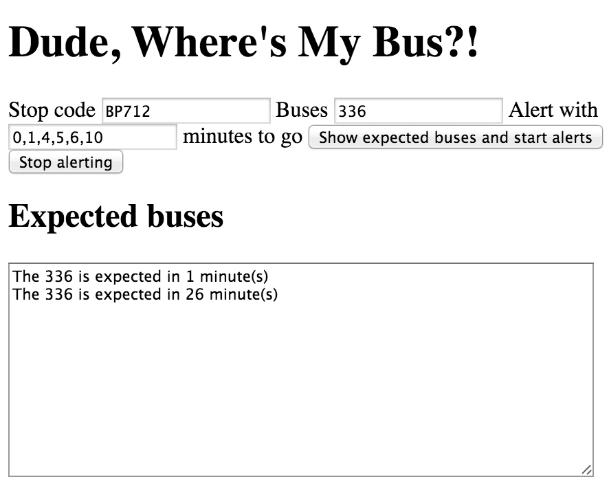

# My ramblings as I build Dude, Where's My Bus?!

Because the commit log doesn't tell the whole story.

## Rough as houses prototype - 5th April '15

Rather than putting everything else in place, the DB, the App server, or any coding for the Android or iOS apps, how about a page that does what I want, alert me when a bus is N minutes away from a given stop?

[](images/dwmc-webapp-rough-cut.png)

### It works!

I've gone for a voice alert with this little bit of code:

```
var utterance = new SpeechSynthesisUtterance(message)
window.speechSynthesis.speak(utterance)
```

I've done this with no consideration for cross browser support. I'll do that now...

... and, [it'll do for now](http://caniuse.com/#search=SpeechSynthesisUtterance). I do check for it before use however.

## What to do next - 6th April '15

My empathy for Product Owners has gone up a notch!

Should I:

- Refactor the code?
- Add a map to choose a Bus Stop?
- Spin up a server to start saving user data?
- Get cracking on one of the mobile apps?
- Put a front-end framework in place?

Refactoring is always high on my list, but adding an FE framework would negate that.

I'll need a map at some point, why not get one up and running now? It can be added without changing any of the existing code. It would comprise a map, a search bar to navigate to your chosen area, a 'Use current location' button as that's a likely scenario. You find your stop, click it and the 'Stop code' field is populated or you. From this a list of possible buses could be spawned.

I think holding off from any API work is a good thing. The front-end requirements will drive the design of the API so I'm happy to wait.

I'm itching to start on one of the mobile apps but I can't fully visualise how they would work so holding off on those feels right too.

## Maps! - 6th & 7th April '15

I decided on implementing the stop map.

I haven't touch Google's map API in a very long time but it's much the same as it was.

More of a challenge was getting the coords for stops from the CSV file supplied by TfL. It comes with northing and easting coordinates. These don't seem to work for Google Maps so I need to convert these to lat and long coords.

A quick read around and a search on npm threw up [ospoint](https://www.npmjs.com/package/ospoint). Testing the conversion and reading up on geo reference systems, I went with ETRS89.

As a side note, to test whether the conversion was getting the right location for stops, I chose a handful of random stops, converted the north/eastings to lat and long and searched on Google Maps.

It's quite early in the morning now and I'm tempted to call it a night (morning?) but I want to at least plot some stops on the map before heading to bed.

## Markers - 7th April '15

Now I have the bus stops data as JSON, I use that to generate the markers.

I'm placing all markers on the map in one go. Not terribly efficient but makes coding easier.

The original zoom level of 9 resulted in a sea of markers obscuring London. To make things a little easier I've now set it to 16. A future enhancement might be to show collective markers but that's not for MVP.

Clicking on a marker will set the Stop code field. Still to to, setting the buses available at a given stop.
